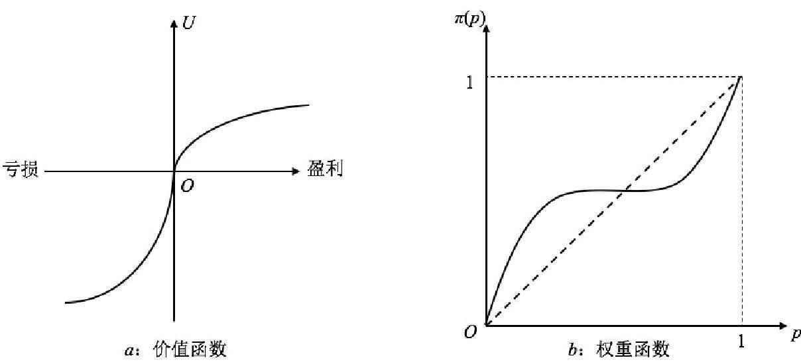

# 前景理论（Prospect Theory）

编者：吴棱  学号：202313093035

## 一、定义

前景理论是行为决策领域的核心理论，由心理学家丹尼尔·卡尼曼（Daniel Kahneman）与阿莫斯·特沃斯基（Amos Tversky）提出。该理论指出：个体在风险环境下进行决策时，并非基于最终财富的绝对水平计算效用，而是以**参考点**为基准判断相对的“收益”与“损失”，并表现出损失厌恶、概率感知扭曲等系统性心理偏差，是对传统理性决策框架的核心修正。

## 二、背景与上下文

- **提出背景**：1979年，卡尼曼与特沃斯基在《Econometrica》发表论文《Prospect Theory: An Analysis of Decision under Risk》，正式提出该理论。传统的期望效用理论以“理性人”为前提，假设人会客观计算概率、追求期望效用最大化，但大量心理学实验反复证明，人们的实际决策系统偏离这一预测，前景理论正是为解释这些真实决策偏差而生。
- **应用领域**：广泛覆盖行为经济学、行为金融学、消费者行为学、管理学、公共政策等领域，可解释股票市场的处置效应、消费者对价格涨跌的不对称反应、保险与彩票购买行为、危机决策等诸多传统理论无法解释的现实现象。
- **重要性**：该理论奠定了行为经济学的理论基石，卡尼曼也凭借相关研究获得2002年诺贝尔经济学奖，推动了整个社会科学对“人类决策有限理性”的系统性认知。

## 三、举例说明

### 例1：经典风险决策实验

- **收益场景**：你面临两个选择：
    1. 确定获得900元
    2. 90%概率获得1000元，10%概率获得0元

  实验中绝大多数人选择选项1，表现为**收益区间的风险规避**。

- **损失场景**：你面临两个选择：
    1. 确定损失900元
    2. 90%概率损失1000元，10%概率无损失

  实验中绝大多数人选择选项2，表现为**损失区间的风险寻求**。

传统期望效用理论无法解释这种同一批人在收益和损失下的偏好反转，而前景理论通过“得失参考点+损失厌恶”可以完美解释：人们面对确定收益时不愿冒险，面对确定损失时反而愿意赌一把规避损失。

### 例2：消费者价格感知

同一件商品最终售价120元：

- 场景1：原价100元，直接涨价到120元，消费者会感知为“损失20元”，购买意愿大幅下降；
- 场景2：先涨价到150元，再打折到120元，消费者会感知为“收益30元”，购买意愿明显提升。

两种场景最终价格完全一致，但因为参考点不同，消费者的决策和感受截然相反，这正是前景理论参考点效应的现实体现。

## 四、对比分析：与期望效用理论的核心区别

期望效用理论以 “理性人” 为前提，认为人可以客观评估概率与收益，选择期望效用最大的方案。前景理论则指出，人类真实决策行为并不符合理性人的假设。

| 对比维度 | 期望效用理论 | 前景理论 |
| :--- | :--- | :--- |
| 决策依据 | 最终财富的绝对水平 | 相对于参考点的相对得失 |
| 概率感知 | 客观、线性地使用概率数值 | 主观扭曲：高估小概率、低估中高概率 |
| 价值/效用函数 | 全局凹函数，始终边际效用递减 | S型函数：收益区凹、损失区凸，损失侧更陡峭 |
| 核心人性假设 | 完全理性，始终追求期望效用最大化 | 有限理性，决策受心理偏差系统性影响 |

## 五、深入扩展：核心运行机制

前景理论的核心由**价值函数**与**概率权重函数**两大模块共同构成，二者的形态如下图所示：

*图1 前景理论核心函数：(a) 价值函数；(b) 概率权重函数*

### 1. 价值函数 Value Function

以参考点为坐标原点，描述客观得失与主观价值的对应关系，具备三个核心特征：

- **参考点依赖**：价值判断不看绝对数量，只看相对于参考点的变化。参考点通常是现状、心理预期或过去的经验值。
- **损失厌恶**：损失带来的负面效用强度，约为同等规模收益带来正面效用的2~2.5倍，对应损失一侧的曲线斜率远大于收益一侧。
- **边际敏感度递减**：收益区间为凹函数，收益越高，新增收益带来的边际快乐越低；损失区间为凸函数，损失越大，新增损失带来的边际痛苦越低。

### 2. 概率权重函数 Probability Weighting Function

人们不会线性使用客观概率，而是对概率进行主观加权，整体呈现反S型规律：

- 高估极低概率事件：比如中彩票、遭遇极端事故，客观概率极低，但人们主观赋予的权重远高于实际概率，因此会主动购买彩票、航空意外险。
- 低估中高概率事件：对于大概率发生的风险，人们会主观降低权重，存在侥幸心理，比如日常不系安全带、忽略基础健康保险。

### 补充：累积前景理论

1992年，两位学者对原始理论进行扩展，提出**累积前景理论**，解决了原始理论仅适用于两结果风险选项的局限，可处理多结果、连续概率分布的决策场景，进一步提升了理论的现实适用范围。

## 六、简明总结

前景理论的核心可以概括为三个关键结论：

1. 决策的核心依据是**相对参考点的得失变化**，而非绝对财富水平；
2. 人对损失的感受强度远高于同等规模的收益（损失厌恶）；
3. 人会主观扭曲概率，系统性高估小概率事件、低估中高概率事件。

该理论打破了“理性人”的理想假设，真实还原了人类决策的心理逻辑，是理解现实中各类决策偏差的核心工具。

---

## 参考文献

[1] KAHNEMAN D, TVERSKY A. Prospect theory: an analysis of decision under risk[J]. Econometrica, 1979, 47(2): 263-291.

[2] TVERSKY A, KAHNEMAN D. Advances in prospect theory: cumulative representation of uncertainty[J]. Journal of Risk and Uncertainty, 1992, 5(4): 297-323.

[3] 卡尼曼 D. 思考，快与慢[M]. 胡晓姣, 李爱民, 何梦莹, 译. 北京: 中信出版社, 2012.
