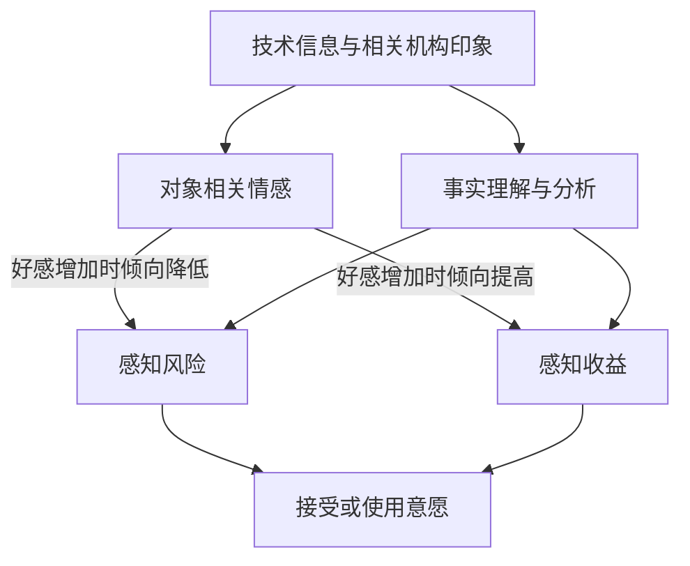
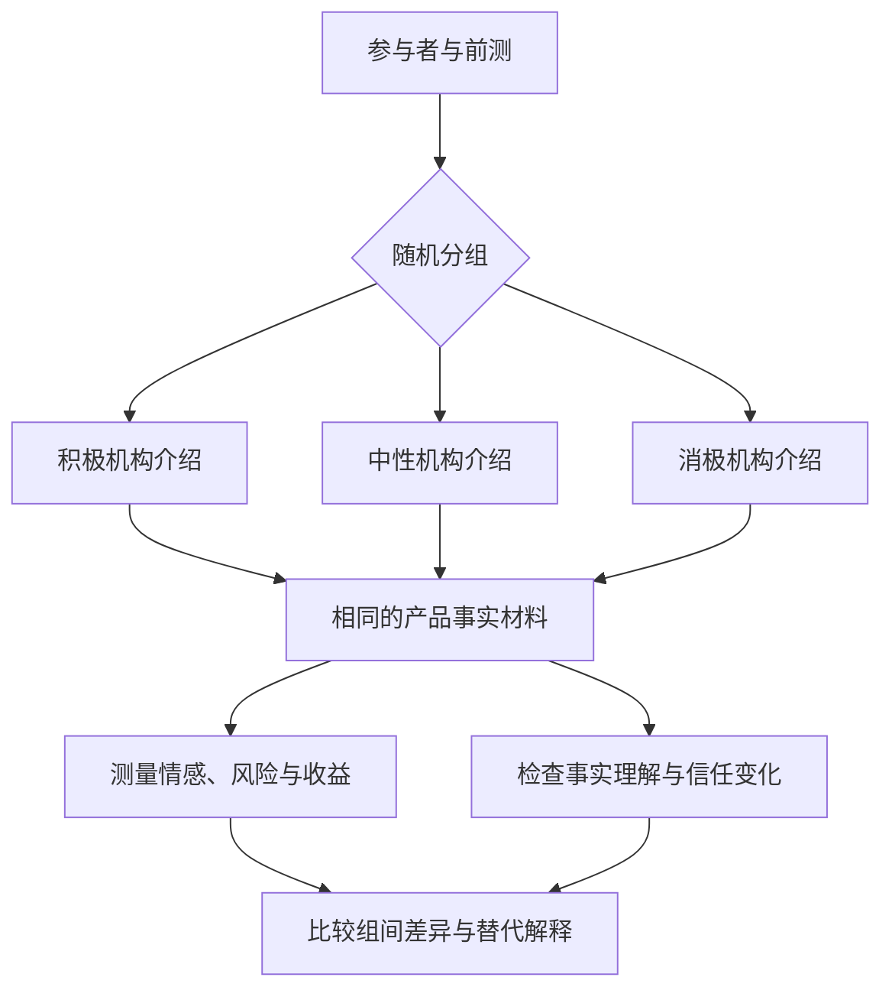

# 28 情感启发式（机制框架）

**词条序号：** 28  
**英文名称：** Affect Heuristic  
**代表学者：** Paul Slovic、Melissa L. Finucane、Ellen Peters、Donald G. MacGregor 等  
**关键词：** 情感、整体印象、风险感知、收益判断、技术风险  
**姓名：** 王龙玺  
**学号：** 202413093036

## 一、定义名词

**情感启发式是指人们在判断或决策时，将对某个对象的整体积极或消极感受作为快速判断线索的一种心理机制。** 面对“这项技术有多危险、能带来多大好处”等复杂问题，人们可能借助“我对它的感觉好不好”形成评价。[1][2]

这里的 *affect* 主要指带有“好—坏”“喜欢—不喜欢”等评价色彩的感受，不一定是强烈、清晰且能被说出的情绪。情感启发式关注的是**感受如何参与判断**，并不是“有情绪就不理性”，也不是对文本进行正面、负面分类的算法。[1]

## 二、背景和上下文

### 2.1 从启发式判断到情感线索

启发式可以理解为简化判断的策略。当时间、知识或注意力有限时，人们未必逐项计算所有可能后果，而会利用容易获得的线索。情感启发式将研究重点放在对象唤起的评价性感受上，补充了仅从信息检索、相似性判断等角度解释决策的思路。[1]

这一框架尤其适合讨论核能、食品技术、人工智能等复杂议题中的公众风险评价。对新闻与舆情研究而言，它提出了一个值得检验的问题：公众对技术及其相关机构的整体印象，是否参与了风险和收益判断？这种联系需要经验研究，不能从评论的情绪色彩直接推断。

### 2.2 理论发展的主要证据

Alhakami 与 Slovic（1994）研究发现，受访者对一些活动或技术的风险评价与收益评价呈负相关：被认为风险较高的对象，往往也被认为收益较低。[3] 这描述的是**主观评价之间的关系**；现实中，一项技术完全可能同时具有较高收益和较大风险。

Finucane 等（2000）进一步开展了两项实验：第一项引入时间压力，观察到风险与收益评价的负相关总体上增强；第二项改变核能、天然气和食品防腐剂的风险或收益信息，发现未被直接提供信息的另一项评价也会随之变化。例如，提高收益评价的信息可能同时降低风险评价。[4] 这些结果支持情感参与判断的解释，但作者也指出，实验并未排除个体使用认知分析策略的可能性。

随后，Slovic 等通过专章和综述系统阐述了情感启发式。[1][2] 因此，该框架是多项研究逐步发展的结果，不宜简单写成某一年由某个人一次性提出的定律。

## 三、举例说明

### 3.1 技术风险：核能的整体印象

**以下为解释概念的假设情境，不是实测结果。** 两个人阅读同一份核能介绍，甲首先联想到稳定供电，乙首先联想到事故与污染。如果甲因为整体好感而判断风险较低、收益较高，乙因为整体反感而判断风险较高、收益较低，就体现了情感启发式可能发挥作用的方式。是否存在高估或低估，还需要与独立的事实依据进行比较。

但仅凭两人的意见不同，还不能确认这一机制。他们也可能掌握不同知识，或对事故后果、能源需求持有不同价值判断。关键是考察：**在相关事实信息得到控制后，整体感受是否仍会影响风险与收益评价。**

### 3.2 新闻与舆情：机构印象与人工智能评价

**以下同样是假设情境。** 某机构发布一款人工智能助手。一位用户因为喜欢该机构的形象，尚未查看隐私条款便判断“它应该很安全”；另一位用户因为厌恶该机构，即使尚不了解产品，也断言“它肯定有很大风险”。这可以形成一个研究假设：机构印象可能通过对产品的整体感受影响技术风险评价。

不过，如果用户依据机构以往的实际安全记录作出判断，其中也可能包含有依据的信息推断。研究时应分别测量**机构好感、机构可信度、产品知识和产品风险评价**，避免将所有信任或不信任都解释成情感启发式。

## 四、对比分析

| 概念或方法 | 主要依据或研究对象 | 与情感启发式的区别 |
| --- | --- | --- |
| 情感启发式 | 对对象的整体好恶感受 | 关注感受作为线索参与判断的过程 |
| 分析式判断 | 概率、后果、证据和明确的推理 | 更强调逐项分析；可以与情感加工共同作用 |
| 可得性启发式 | 相关事件或案例是否容易想起 | 关键线索是记忆或想象的容易程度，不是好恶本身 |
| 代表性启发式 | 对象与某类典型形象是否相似 | 关键线索是相似性，而非整体感受 |
| 文本情感分析 | 文本表达的情感倾向或情绪类别 | 提供表达层面的分类，不能独自识别判断机制 |

前几种判断方式的区分可参考情感启发式及风险判断文献。[1][5] 同一事件中，它们可能同时出现。例如，一段事故视频既容易被记住，又令人恐惧，仅靠一次问卷回答很难区分两种线索各自的作用。

情感与分析也不是互相排斥的。Slovic 等（2004）强调，两类加工能够相互影响，合理决策需要二者配合。[5] 因而不能将“快速判断”等同于“必然错误”，也不能将“经过思考”等同于“完全不受情感影响”。

## 五、深入扩展：机制、测量与证据边界

### 5.1 情感如何参与风险与收益判断

研究者用“情感池”（affect pool）描述与心理表征相联系的积极、消极感受。人们想到某种对象时，相关经验和印象可能被唤起，这些感受可以成为判断线索。[5] “情感池”是一种理论表述，不是可以直接读取的情绪数据库，也不意味着已经定位到单一脑区。

在经典风险—收益框架中，对对象的好感通常对应较低的主观风险与较高的主观收益，反感则可能对应相反方向。[3][4] 这里讨论的是经验倾向，不是“喜欢就一定低估风险”的确定性规则；不同对象、个体和情境都可能改变这种关系。

*图 1 情感参与技术评价的概念示意。根据文献 [4][5] 的思路整理，并扩展至接受意愿；箭头表示待检验的解释路径，不是本文已经证实的因果关系。*

图中，风险和收益既可能受到共同情感线索的影响，也可能受到事实分析的影响。例如，公众可以同时认可技术收益并担忧其风险；这并不违背情感启发式，因为情感并非唯一判断依据。机构印象能否迁移到产品感受，也应单独检验。

### 5.2 形式化解释：为什么风险和收益可能负相关

为了说明共同情感线索的作用，可以对同一项技术建立以下联合模型：

$$
\begin{aligned}
R_i &= \alpha_R-\beta_R A_i+\boldsymbol{\gamma}_R^{\mathsf T}\mathbf{X}_i+\varepsilon_{Ri},\\
B_i &= \alpha_B+\beta_B A_i+\boldsymbol{\gamma}_B^{\mathsf T}\mathbf{X}_i+\varepsilon_{Bi}.
\end{aligned}
$$

其中，$R_i$ 和 $B_i$ 分别为个体 $i$ 的感知风险和感知收益，$A_i$ 越大表示对该技术的感受越积极，$\mathbf{X}_i$ 包括既有知识、经验等背景变量；$\alpha_R,\alpha_B$ 为截距，$\boldsymbol{\gamma}_R,\boldsymbol{\gamma}_B$ 为背景变量系数，$\varepsilon_{Ri},\varepsilon_{Bi}$ 为模型未解释的部分。经典框架对应的研究假设是 $\beta_R>0,\beta_B>0$，即好感增加与风险评价下降、收益评价上升相关。实际估计时不应预先强制系数满足这些符号，而应让数据检验假设。

**上述模型是本文对理论的教学性形式化，不是原论文给出的固定公式。** 它的作用是把“感受影响判断”转化为可以检验的变量关系。

在给定 $\mathbf{X}$、且情感与两项残差分别条件不相关的假设下，由协方差的运算规则可得：

$$
\mathrm{Cov}(R,B\mid\mathbf{X})
=-\beta_R\beta_B\mathrm{Var}(A\mid\mathbf{X})
+\mathrm{Cov}(\varepsilon_R,\varepsilon_B\mid\mathbf{X}).
$$

如果进一步假设两项残差条件不相关，且 $\beta_R,\beta_B>0$、情感仍存在个体差异，则该条件协方差为负。直观上，**同一个情感线索把风险评价向下推、把收益评价向上推，就可能使二者呈负相关**。但如果未纳入的其他因素同时影响风险和收益，残差相关就不能忽略，最终关系也未必为负。

例如，仅为演示而设定 $A\in[-1,1]$、$R=4-A$、$B=4+A$，可以得到：

| 情感得分 $A$ | 示例含义 | 风险得分 $R$ | 收益得分 $B$ |
| --- | --- | --- | --- |
| $-1$ | 较消极 | $5$ | $3$ |
| $0$ | 中性 | $4$ | $4$ |
| $1$ | 较积极 | $3$ | $5$ |

*表中数字均为人为设定的教学示例，不是调查结果。该无残差模型产生完全负相关，仅用于突出共同线索的作用；真实数据通常包含测量误差与其他影响因素。*

因此，负相关是与理论相容的一种结果，**不能反过来仅凭负相关就认定情感启发式成立**。同样，回归系数显著也不能自动说明因果关系。

### 5.3 如何把概念转化为测量

研究至少应区分以下几个变量。表中的问题是**教学性操作化示例，并非现成的标准量表**，正式使用前需要预试与效度检验。

| 变量 | 示例问题或指标 | 需要避免的混淆 |
| --- | --- | --- |
| 对象相关情感 | “想到这项技术时，你的总体感受是消极还是积极？” | 不宜用当天整体心情代替对该技术的感受 |
| 感知风险 | “你认为它造成隐私损害的可能性有多大？” | 概率、严重程度与总体风险应区分测量 |
| 感知收益 | “你认为它能在多大程度上提高工作效率？” | 不宜直接用总体喜欢程度代替收益评价 |
| 机构印象与信任 | 对机构的好感、能力判断和诚信评价 | 好感与可信度不是同一个构念 |
| 相关背景 | 既有知识、使用经验、初始立场 | 它们可能同时影响情感和风险判断 |

实际问卷中，可以分别设置多个情感、风险和收益题项，检查题项是否测到了预期概念。若将多个题项合成为一个分数，应说明计分方向及信效度；不要把“喜欢”“安全”“有用”混成一个总分后，再用这个总分解释三者之间的关系。

还应说明相关系数的计算层级：“同一个人对多项技术的风险—收益相关”与“不同人对同一项技术的风险—收益相关”回答的问题不同，不应混用。Skagerlund 等（2020）研究了不同评价方式和领域下的关系，并发现负相关强度与个体认知能力、尤其认知反思能力有关。[6] 这提示我们，测量设计与个体差异都需要纳入考虑。

### 5.4 实验设计：从组间差异到中介路径

以“机构印象是否影响人工智能风险评价”为例，可以提出以下**教学性实验方案，并非已经完成的研究**：

1. **明确对象并预先测量。** 选择同一款虚构产品，记录参与者的相关知识和初始态度。
2. **随机分配材料。** 呈现积极、消极或中性的机构介绍，同时保持产品功能、隐私风险和收益数据一致。机构介绍应尽量避免夹带技术能力、安全记录等诊断性信息。
3. **分别测量与检查。** 测量机构好感、产品感受、风险和收益判断，并检验材料是否同时改变了能力判断、可信度或事实理解。题目顺序宜随机化或平衡，以减少顺序效应。
4. **比较解释。** 检查不同组的判断差异是否与情感变化相符，同时考虑信任推断、需求效应等替代解释。

*图 2 机构印象与技术评价的教学性实验流程。三组的产品事实保持一致，重点检验机构介绍是否改变感受及后续评价。*

若进一步考察“介绍材料是否通过情感改变风险判断”，可先选取积极组与中性组作预先设定的对比，令 $Z_i=1$ 表示积极组、$Z_i=0$ 表示中性组，建立不含交互项的线性中介模型：

$$
\begin{aligned}
A_i &= a_0+aZ_i+\mathbf{p}^{\mathsf T}\mathbf{X}_i+u_i,\\
R_i &= r_0+c'Z_i+bA_i+\mathbf{q}^{\mathsf T}\mathbf{X}_i+v_i.
\end{aligned}
$$

这里，$a$ 描述材料组别与情感的关系，$b$ 描述控制组别和前测变量后情感与风险的关系，$c'$ 描述不经过该情感变量的模型路径；$a_0,r_0$ 为截距，$\mathbf{p},\mathbf{q}$ 为前测变量系数，$u_i,v_i$ 为残差。消极组与中性组可另作对比，不应未经论证便把三组编码为等距的单一连续变量。

在上述线性模型及相应条件下，间接路径由系数乘积表示：

$$
\text{间接路径}=ab,\qquad
\text{直接路径}=c',\qquad
\text{总路径}=c'+ab.
$$

若积极介绍提高好感（$a>0$），且好感与较低风险评价相关（$b<0$），则 $ab<0$，符合“通过积极感受降低风险评价”的方向。研究中应报告估计值及置信区间，并检查结果对模型设定的敏感性。

这些路径要解释为**因果效应**，还需要无未测量的情感—风险混杂等识别假设，以及合适的时间顺序和模型设定。随机分组只保证材料分配的随机性，并不会使参与者的情感本身随机化。[8] 如果材料同时改变了可信度或能力判断，应将其作为竞争机制分析，而不能简单加入所有事后变量便宣称问题已解决。

### 5.5 为什么情绪分类结果不是认知机制的直接测量

假设一条评论写道：“这个人工智能产品太可怕了，我觉得隐私风险很大。”分类器将其识别为负面，只能提供关于**文本表达**的证据。要进一步解释为情感启发式，至少还面临四个问题：

- **测量对象不同。** 分类器分析的是文字，未必准确反映作者的真实感受；反讽、引用和语境都可能影响结果。
- **情绪指向不同。** 用户可能厌恶的是企业、宣传方式或其他评论者，而非技术本身。
- **因果方向不明。** 既可能是恐惧提高了风险判断，也可能是读到真实风险后产生恐惧，或两者都由第三个因素引起。
- **缺少过程证据。** 正面或负面标签没有直接显示作者是否把整体感受当成判断线索。

即使识别到了“负面情绪”，也不应假设所有负面情绪都产生相同影响。Lerner 与 Keltner（2001）在其研究情境中发现，恐惧与愤怒虽同属负面情绪，却对应不同方向的风险估计与选择倾向。[7] 这补充了仅以正负效价理解判断的视角，也说明将复杂情绪压缩为一个负面分数会丢失信息。

因此，在新闻与舆情数据研究中，可以先将文本分析用于识别情绪表达、评价对象和风险话语，再结合问卷或实验检验心理解释。仅有文本分类时，合适的表述是“观察到负面表达与风险话语共现”，而不是“证明公众使用了情感启发式”。分类器输出的置信分数也不等于某人使用该机制的概率。

| 已获得的证据 | 可以支持的表述 | 仍然缺少的证据 |
| --- | --- | --- |
| 评论被判为负面 | 文本表现出负面表达特征 | 真实感受、评价对象及判断过程 |
| 好感与风险评价负相关 | 两个测量变量存在关联 | 因果方向与共同原因的排除 |
| 随机材料改变风险评价 | 在设计有效的条件下，材料影响了判断 | 影响是否通过情感发生 |
| 中介路径与预期一致 | 结果支持所提出的机制解释 | 识别假设、替代机制与稳健性检查 |

## 六、简明总结

情感启发式说明，人们可能借助对对象的整体感受判断风险和收益。它为研究技术印象、机构评价与公众判断之间的联系提供了机制框架，也提醒我们关注信息如何被体验和理解。

应用这一框架时，必须区分**文本中的情绪表达、个体的情感状态与情感参与判断的机制**。情绪分类、相关系数或一次实验都只能提供特定层面的证据；关于机制的解释，应与研究设计所能支持的结论相匹配。

## 参考文献

[1] Slovic, P., Finucane, M., Peters, E., & MacGregor, D. G. (2002). The affect heuristic. In T. Gilovich, D. Griffin, & D. Kahneman (Eds.), *Heuristics and Biases: The Psychology of Intuitive Judgment* (pp. 397–420). Cambridge University Press. [DOI](https://doi.org/10.1017/CBO9780511808098.025)

[2] Slovic, P., Finucane, M. L., Peters, E., & MacGregor, D. G. (2007). The affect heuristic. *European Journal of Operational Research*, 177(3), 1333–1352. [DOI](https://doi.org/10.1016/j.ejor.2005.04.006)

[3] Alhakami, A. S., & Slovic, P. (1994). A psychological study of the inverse relationship between perceived risk and perceived benefit. *Risk Analysis*, 14(6), 1085–1096. [DOI](https://doi.org/10.1111/j.1539-6924.1994.tb00080.x)

[4] Finucane, M. L., Alhakami, A., Slovic, P., & Johnson, S. M. (2000). The affect heuristic in judgments of risks and benefits. *Journal of Behavioral Decision Making*, 13(1), 1–17. [DOI](https://doi.org/10.1002/%28SICI%291099-0771%28200001/03%2913%3A1%3C1%3A%3AAID-BDM333%3E3.0.CO%3B2-S)；[公开全文](https://stanford.edu/~knutson/jdm/finucane00.pdf)

[5] Slovic, P., Finucane, M. L., Peters, E., & MacGregor, D. G. (2004). Risk as analysis and risk as feelings: Some thoughts about affect, reason, risk, and rationality. *Risk Analysis*, 24(2), 311–322. [DOI](https://doi.org/10.1111/j.0272-4332.2004.00433.x)

[6] Skagerlund, K., Forsblad, M., Slovic, P., & Västfjäll, D. (2020). The affect heuristic and risk perception – Stability across elicitation methods and individual cognitive abilities. *Frontiers in Psychology*, 11, Article 970. [DOI](https://doi.org/10.3389/fpsyg.2020.00970)

[7] Lerner, J. S., & Keltner, D. (2001). Fear, anger, and risk. *Journal of Personality and Social Psychology*, 81(1), 146–159. [DOI](https://doi.org/10.1037/0022-3514.81.1.146)

[8] Imai, K., Keele, L., & Yamamoto, T. (2010). Identification, inference and sensitivity analysis for causal mediation effects. *Statistical Science*, 25(1), 51–71. [DOI](https://doi.org/10.1214/10-STS321)；[作者公开全文](https://imai.fas.harvard.edu/research/files/mediation.pdf)
