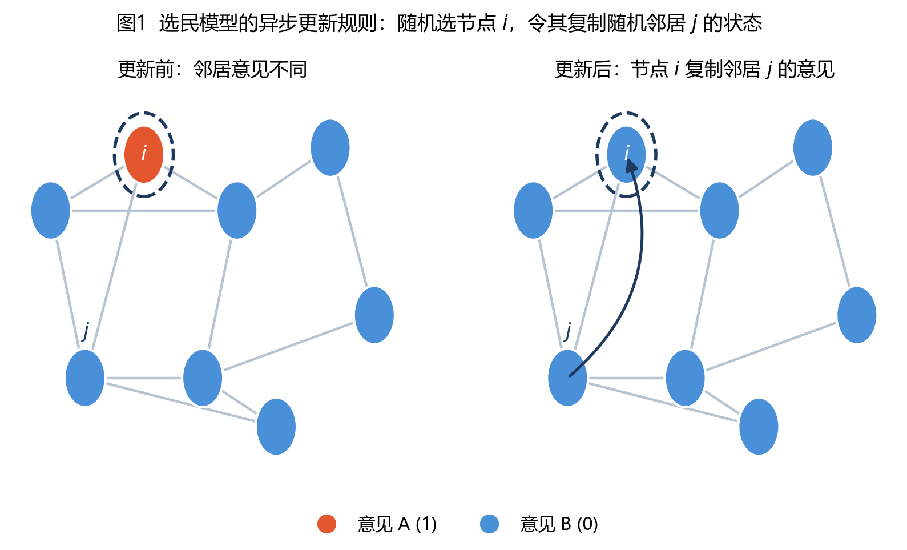
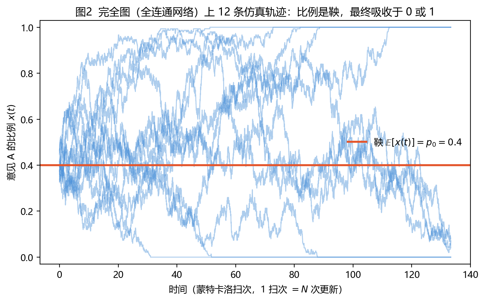
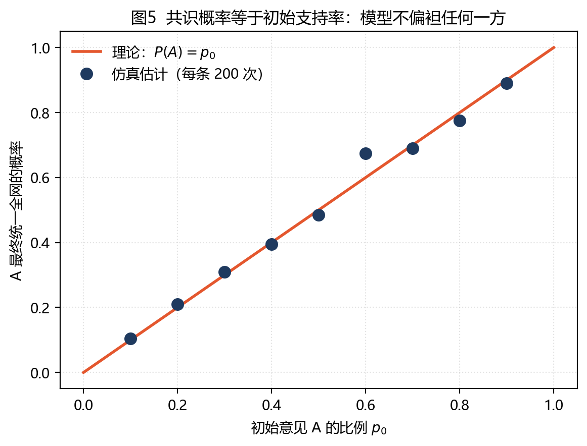
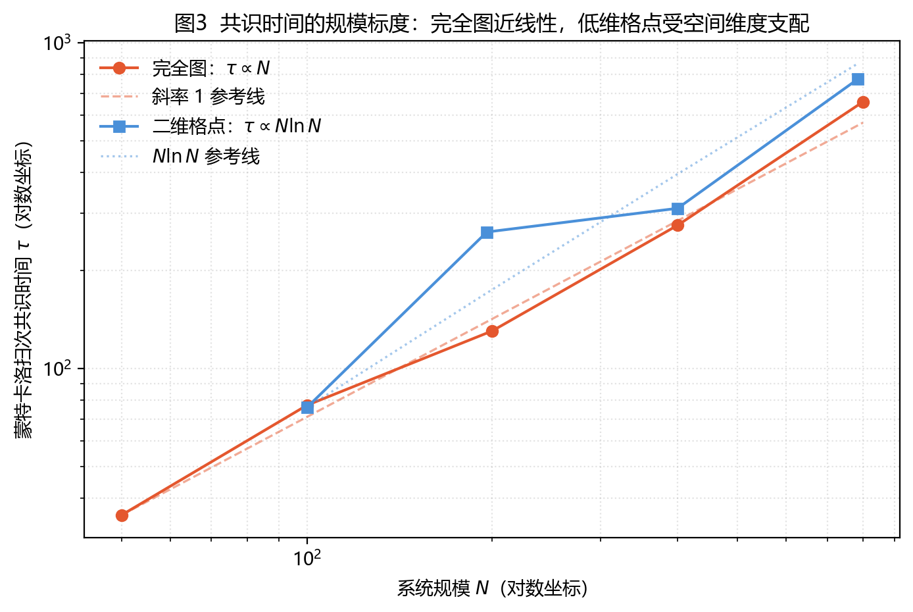
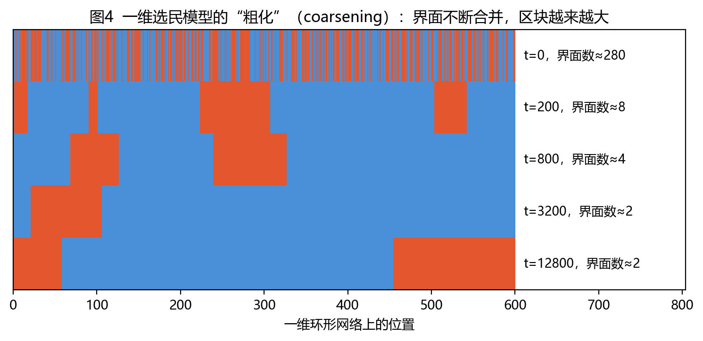

# 57 选民模型（随机过程模型）

**姓名**：汤明畅　**学号**：202413093009　**班级**：24级数据科学与大数据技术1班

> **关键词**：选民模型（Voter Model）、意见动力学、交互粒子系统、鞅、共识时间、对偶性、粗化
> **英文名称**：Voter Model / Voter Model of Opinion Dynamics
> **提出者**：Clifford & Sudbury（1973）；Holley & Liggett（1975）

---

## 一、定义

**选民模型（Voter Model）** 是描述二元意见在网络中如何扩散并最终走向共识的最简单的**随机过程模型**之一。它把社会影响还原为一条极简规则：**每个个体只是随机地“复制”某个邻居的意见**。

设网络由 $N$ 个节点（个体）组成，节点 $i$ 在时刻 $t$ 的意见用二元状态表示：

$$
x_i(t)\in\{0,1\},\qquad i=1,2,\dots,N,
$$

其中 $1$ 表示支持意见 A，$0$ 表示支持意见 B。

**异步更新规则**：在每个时间步，只做两件事——

1. 在 $N$ 个节点中**等概率随机选出一个待更新节点** $i$；
2. 在 $i$ 的邻居集合 $\mathcal{N}(i)$ 中**等概率随机选出一个邻居** $j$，并令

$$
x_i(t+1)=x_j(t).
$$

规则用一句话概括就是：**“随机找一个人，让他随便抄一个邻居的观点。”**

*图1　选民模型的异步更新规则：虚线圆圈标出被随机选中的节点 $i$，箭头表示它复制了邻居 $j$ 的意见，于是自己的颜色随之改变。*

值得注意的是，规则中**没有任何认知加工**：个体不比较、不权衡、不推理，也不判断信息的对错，只做“照抄”。正因如此，选民模型通常不作为对现实舆论的完整解释，而是作为**意见扩散与共识过程的模拟基线（null model）**。

---

## 二、背景和上下文

### 2.1 学术脉络

选民模型诞生于 20 世纪 70 年代**交互粒子系统（interacting particle systems）**这一概率论分支。这类系统研究无穷多个随机演化的个体之间如何相互作用，并考察整体是否会出现某种“宏观有序”。

- 1973 年，**Clifford 与 Sudbury** 在 *Biometrika* 上提出 *A model for spatial conflict*，用以描述两个种群在空间竞争中的边界演化，被视为选民模型的雏形；
- 1975 年，**Holley 与 Liggett** 在研究弱相互作用的无穷系统遍历性时，正式给出了该模型的数学刻画，“voter model”这一名称由此固定下来。

此后，**Liggett** 的专著《Interacting Particle Systems》（1985）系统整理了其理论基础，使其成为概率论中的经典模型。

### 2.2 为什么重要

选民模型的重要性并不在于它“像”真实舆论，而在于它提供了三条**理论基准线**：

1. **共识会不会发生？**——它证明了在有限连通网络上，二元意见结构几乎必然收敛到全体一致（共识）；
2. **共识需要多久？**——它给出了共识时间（consensus time）随系统规模 $N$ 增长的标度律；
3. **谁最终胜出？**——它给出了“某一方统一全网”的概率，即初始支持率。

因此，任何更复杂的意见动力学模型（有界信任、多数决、情感驱动、算法推荐）都可以拿选民模型作为**对照基线**：如果某现象用最朴素的“照抄”机制就能解释，就不必引入复杂认知过程。

### 2.3 应用场景

在网络科学、统计物理、数学社会学和**计算传播学**中，选民模型被广泛用于：

- 舆情传播、选民投票倾向的演化建模；
- 复杂网络（无标度网络、小世界网络）上共识速度的比较研究；
- 多智能体系统的**一致性（consensus）算法**与分布式协同；
- 作为机器学习中种群博弈、演化动力学分析的简化模型。

---

## 三、举例说明

### 3.1 一个“转发式站队”的小例子

设想一个 6 人的微信群，讨论一次公共事件，成员只有两种态度：支持（红）与质疑（蓝）。群内好友关系构成一张小网络。

某一步中，系统随机选中了节点 $i$；此时 $i$ 的邻居里有红有蓝，于是 $i$ 随机挑中蓝方邻居 $j$，并把自己的态度改成了蓝——**这就是一次更新**（对应图1）。随后系统再随机选下一个人重复该过程。

如果把这一过程在计算机上重复很多次，会看到图2所示的现象：每个人的态度在红蓝之间反复跳变，**但“支持率”整体上像没有方向的随机游走**，既不上涨也不下跌，最终突然“卡”在全红或全蓝上，此后再也不变。

*图2　完全图（全连通网络）上 12 条独立仿真轨迹。红线为初始支持率 $p_0=0.4$；所有轨迹在 0 与 1 两个吸收态停下，且围绕 $p_0$ 上下波动、没有系统性漂移。*

### 3.2 社交平台上的对应现象

- **选战舆情的“拉锯”**：在两名候选人之间摇摆的群体，其支持率常表现出随机波动，而非持续单向漂移；
- **饭圈内部的“统一口径”**：一旦群内某种态度占据压倒性多数，少数派会迅速被“同化”，呈现典型的**共识坍缩**；
- **实验证据**：社交网络上的“模仿—跟随”行为（点赞、转发、取关）与模型的复制规则高度相似。

### 3.3 结果的方向由谁决定

一个反直觉但重要的结论是：**最终谁胜出，几乎完全由初始比例和随机涨落决定，与“谁更有道理”无关。** 图5 的仿真显示，A 方最终统一全网的概率恰好等于其初始支持率 $p_0$。

*图5　共识概率的仿真结果与理论直线 $P(A)=p_0$ 高度吻合。模型不偏袒任何一方，这正是“中性”零模型的核心特征。*

---

## 四、对比分析

### 4.1 与其他意见动力学模型的比较

| 比较维度 | **选民模型** | Glauber / Ising 模型 | 多数决模型（Majority Rule） | 有界信任模型（Bounded Confidence） |
|---|---|---|---|---|
| 意见取值 | 二元 $\{0,1\}$ | 二元自旋 $\{\pm1\}$ | 二元 | **连续** $\mathbb{R}$ |
| 更新依据 | 复制**随机**邻居 | 依温度 $T$ 的**噪声**翻转 | 复制**多数**邻居 | 与意见差距小于阈值者交流 |
| 平衡态 | 必然共识（有限图） | $T<T_c$ 有序、$T>T_c$ 无序 | 可能共识也可能僵持 | 可能出现**多个意见簇** |
| 关键参数 | 网络结构与 $N$ | 温度 $T$ | 邻居规模 | 信任阈值 $\varepsilon$ |
| 数学性质 | 鞅、可对偶 | 细致平衡、Gibbs 测度 | 非线性、非鞅 | 非线性、非马尔可夫 |

**核心区别**：选民模型是**线性的**——宏观意见比例满足鞅性质（见第五节），因此“不偏袒”；而多数决模型和有界信任模型是**非线性的**，会产生偏好放大、意见极化与碎片化。

### 4.2 与谣言传播模型（DK / SIR）的比较

| 比较维度 | 选民模型 | Daley–Kendall / SIR |
|---|---|---|
| 意见状态数 | 二元、可反复改变 | 三态、状态单向不可逆 |
| 过程终点 | **共识**（全体一致） | 传播**熄灭**（不再有传播者） |
| 守恒量 | 期望比例守恒 | 无（人口最终进入吸收态） |
| 关注的问题 | 共识时间、共识概率 | 传播规模、峰值、终止条件 |

DK/SIR 描述“信息从有到无”的**单向扩散**，而选民模型描述“意见此消彼长”的**可逆竞争**。两者分别对应舆情研究中的传播问题与共识问题。

### 4.3 与遗传学中的 Moran 过程比较

选民模型在完全图上等价于群体遗传学中的 **Moran 过程**（中性漂变）：两个等位基因的固定概率等于其初始频率，固定时间与 $N$ 同阶。这种跨学科的等价性说明，选民模型刻画的是一个**中性的随机漂变机制**。

---

## 五、深入扩展：数学模型

### 5.1 生成元与主方程

设构型 $\eta=(\eta_1,\dots,\eta_N)\in\{0,1\}^N$。选民模型的连续时间生成元（Markov 预解算子）为

$$
(\mathcal{L}f)(\eta)=\frac{1}{N}\sum_{i=1}^{N}\sum_{j\in\mathcal{N}(i)}
\frac{1}{d_i}\Big[f(\eta^{i\leftarrow j})-f(\eta)\Big],
$$

其中 $\eta^{i\leftarrow j}$ 表示把节点 $i$ 的状态改为节点 $j$ 的状态，$d_i=|\mathcal{N}(i)|$ 为节点 $i$ 的度。即：**每个节点以速率 1、以 $1/d_i$ 的概率采用某个邻居的状态。**

### 5.2 线性性：意见比例是鞅

定义意见 A 的宏观比例

$$
\rho(t)=\frac{1}{N}\sum_{i=1}^{N}x_i(t).
$$

考察一次更新对 $\rho$ 的期望影响。被选中的节点 $i$ 复制邻居 $j$ 后，$\rho$ 的改变量为 $\dfrac{1}{N}\big(x_j-x_i\big)$。

先看**完全图**（每个节点与其余所有节点相连）：此时 $j$ 在“除 $i$ 外的其余 $N-1$ 个节点”中等概率选取，故

$$
\mathbb{E}\big[x_j\,\big|\,\eta\big]
=\frac{1}{N-1}\sum_{l\neq i}x_l
=\frac{N\rho-x_i}{N-1}.
$$

再对随机选出的 $i$ 求期望（$i$ 均匀分布，故 $\mathbb{E}[x_i]=\rho$）：

$$
\mathbb{E}\big[\rho(t+1)-\rho(t)\,\big|\,\eta\big]
=\frac{1}{N}\left(\frac{N\rho-\rho}{N-1}-\rho\right)=0.
$$

即

$$
\mathbb{E}\big[\rho(t+1)\,\big|\,\rho(t)\big]=\rho(t).
$$

也就是说，**$\rho(t)$ 是一个鞅**。（在 $d$-正则网络如二维格点上，逐边的漂移同样恰好抵消，结论不变；在度分布高度异质的网络上，守恒量变为度数加权的 $\sum_i d_i x_i$。）由鞅收敛定理，$\rho(t)$ 几乎必然收敛到 $\{0,1\}$ 中的某个吸收值。结合**可选停时定理**可得

$$
\boxed{\;\mathbb{P}\big(\text{A 最终胜出}\big)=\rho(0)=p_0\;}
$$

这正是图5 中仿真点落在对角线上的原因。**模型对任何一方都不偏袒**，这是它区别于多数决模型的关键。

### 5.3 共识时间

仍以完全图为例。设当前 A 的个数为 $k$，一次更新中 A 的个数发生改变的概率为

$$
\Pr(k\to k+1)=\Pr(k\to k-1)=\frac{k(N-k)}{N(N-1)},
$$

**增加与减少的概率严格相等**，改变量各为 $\pm1$。因此，若只看“真正发生改变”的那些更新，$k$ 就是一个 $\{0,1,\dots,N\}$ 上的**简单对称随机游走**。由随机游走的经典结论，从 $k$ 出发到达 $0$ 或 $N$ 的**期望改变次数**为

$$
\mathbb{E}\big[\#\text{改变}\big]=k(N-k),
$$

在 $k=N/2$ 时取最大值 $N^2/4$。

把它换算为**连续时间**（令每个节点以速率 1 独立更新），可以求出期望共识时间的封闭表达式：

$$
\boxed{\;\mathbb{E}[T]=-(N-1)\Big[\,p\ln p+(1-p)\ln(1-p)\,\Big]\;}
$$

其中 $p=k/N$ 为初始支持率。该式在 $p=1/2$ 时取最大值

$$
\mathbb{E}[T]_{\max}=(N-1)\ln 2\approx 0.693\,(N-1),
$$

即**完全图上的共识时间与 $N$ 成正比**，与图2 中约 100 个扫次后完成吸收的量级一致。

一般地，共识时间的标度律强烈依赖于**网络的空间维度** $d$（Bramson、Cox 与 Griffeath）：

$$
\tau(N)\sim
\begin{cases}
N^{2} & d=1 \quad(\text{一维链}),\\
N\ln N & d=2 \quad(\text{二维格点}),\\
O(N) & d\ge 3 \quad(\text{高维格点/平均场}).
\end{cases}
$$

其中 $d\ge 3$ 时选民模型在无穷格点上**不再实现共识**，而是收敛到一个非平凡平稳分布——宏观比例一直波动。图3 的仿真验证了完全图近线性、二维格点受 $N\ln N$ 支配的差异。

*图3　共识时间随系统规模 $N$ 的标度关系（双对数坐标）。完全图（红）近似斜率 1，二维格点（蓝）明显更陡，与 $N\ln N$ 一致。*

### 5.4 空间粗化（Coarsening）

在低维网络上，共识是通过**界面的不断合并**实现的。一维选民模型中的“同色区块”会随时间不断变长，界面数目以

$$
n_{\text{界面}}(t)\sim \frac{1}{\sqrt{t}}
$$

的速率衰减，区块特征长度满足 $\ell(t)\sim\sqrt{t}$。这一现象称为**粗化（coarsening）**，图4 给出了直观展示。

*图4　一维环形网络上选民模型的时间快照。红色与蓝色区块不断合并变大，界面数持续减少——共识是一个“局部扩散—全局合并”的过程。*

### 5.5 对偶性：与聚结随机游走的联系

选民模型最重要的数学性质之一是**对偶性（duality）**：追究单个节点 $i$ 的状态来源，把它的“祖先”逐步回溯，会得到一组在网络上随机游走、相遇即合并的轨迹，即**聚结随机游走（coalescing random walks）**。由此可得

$$
\mathbb{E}\big[x_i(t)\big]=\sum_{j=1}^{N}P_t(i,j)\,x_j(0),
$$

其中 $P_t(i,j)$ 是随机游走从 $i$ 到 $j$ 的 $t$ 步转移概率。这一等式把**意见的期望演化**转化为**随机游走的几何问题**：两点的意见期望之差 $|x_i-x_j|$ 只取决于两个随机游走在 $t$ 时刻前是否已经聚结。共识时间因此等价于**所有随机游走全部聚结所需的时间**，这是推导上述标度律的核心工具。

### 5.6 模型的假设与局限

选民模型建立在一组很强的简化假设之上：

| 假设 | 现实偏差 |
|---|---|
| 意见只有二元 $\{0,1\}$ | 真实立场是多维、连续的，**二元状态会压缩多维立场** |
| 个体只“照抄”，无认知 | **不含复杂认知过程**：无推理、无说服、无信息评估 |
| 无外部输入 | 忽略媒体议程、平台算法与关键意见领袖 |
| 均匀采纳邻居 | 忽略信任差异、关系强度与从众压力 |
| 网络静态 | 现实中的关系网随时间重构 |

因此，把选民模型直接当作现实舆情的预测工具是不合适的；它的合理定位是**机制基线**。

---

## 六、现代发展及应用

### 6.1 从规则网络到复杂网络

真实社交网络具有无标度、社区化和高聚类等特征。研究者发现：在**异质网络**上，共识时间与节点度的二阶矩密切相关，枢纽节点显著加速或延缓共识（Sood & Redner, 2005；Suchecki 等, 2005；Vázquez & Eguíluz, 2008）。这为“关键意见领袖为何重要”提供了理论解释。

### 6.2 从线性到非线性：q-选民模型

为刻画“从众”效应，Castellano、Muñoz 与 Pastor-Satorras 提出 **$q$ 选民模型**：个体同时参考 $q$ 个邻居，且只有在 $q$ 人意见完全一致时才改变态度。该模型出现**有序—无序相变**，能够解释现实中出现的**共识、极化与僵持**等多种结局，弥补了经典模型“必然共识”的不足。

### 6.3 顽固者与外部干预

引入**顽固者（zealots）**——永不改变立场的个体——会显著改变系统行为：少量顽固者即可阻止无限群体达成共识（Mobilia, 2003）。这为舆论引导、话题“定调”与平台干预提供了模型层面的启示。

### 6.4 交叉应用与工程落地

| 应用方向 | 主要任务 |
|---|---|
| 舆情基线分析 | 判断某现象是否可由“纯模仿”解释 |
| 平台治理 | 评估算法推荐、干预节点对共识速度的影响 |
| 分布式系统 | 多智能体一致性协议与容错共识 |
| 机器学习 | 种群博弈、演化动力学与社会学习建模 |
| 跨学科 | 与生物学形态发生、生态竞争模型的类比 |

### 6.5 与计算传播学的结合

在计算传播学中，选民模型常作为**零模型**：研究者先构造具有真实网络结构与初始比例的选民模型，得到“纯模仿”下的共识时间与共识概率，再将真实舆情数据与之对比。若真实数据显著偏离基线（例如出现持续的极化而非共识），则说明存在**认知偏差、算法放大或外部干预**等额外机制——这正是“以基线反推机制”的研究思路。

---

## 七、简明总结

选民模型的核心可以归纳为三点：

1. **一条规则**：随机选一个节点，让它复制一个随机邻居的意见；
$$
x_i(t+1)=x_j(t),\qquad j\in\mathcal{N}(i)\ \text{随机}.
$$

2. **两个结论**：
   - **共识概率 = 初始比例**（比例是鞅）：$\mathbb{P}(\text{A 胜出})=p_0$；
   - **共识时间有标度律**：完全图 $\tau\sim N$，二维格点 $\tau\sim N\ln N$，一维 $\tau\sim N^{2}$。

3. **一个定位**：它是**二元意见扩散与共识时间的模拟基线**。它用最少的假设揭示了“纯模仿”能带来什么、不能带来什么：
$$
\boxed{\text{纯模仿}\ \Rightarrow\ \text{必然共识，且不偏袒任何一方}}
$$

因此，当现实舆论出现**极化、僵持或立场碎片化**时，这种偏离本身就成了重要信号——它提示我们必须引入选民模型所忽略的**复杂认知过程与多维立场**。

---

## 参考文献

[1] CLIFFORD P, SUDBURY A. A model for spatial conflict[J]. *Biometrika*, 1973, 60(3): 581–588. DOI: 10.1093/biomet/60.3.581.

[2] HOLLEY R A, LIGGETT T M. Ergodic theorems for weakly interacting infinite systems and the voter model[J]. *The Annals of Probability*, 1975, 3(4): 643–663. DOI: 10.1214/aop/1176996306.

[3] LIGGETT T M. *Interacting Particle Systems*[M]. New York: Springer-Verlag, 1985.

[4] COX J T, GRIFFEATH D. Coalescing random walks and voter model consensus times on the torus in $\mathbb{Z}^d$[J]. *The Annals of Probability*, 1989, 17(4): 1333–1366. DOI: 10.1214/aop/1176991158.

[5] CASTELLANO C, FORTUNATO S, LORETO V. Statistical physics of social dynamics[J]. *Reviews of Modern Physics*, 2009, 81(2): 591–646. DOI: 10.1103/RevModPhys.81.591.

[6] SOOD V, REDNER S. Voter model on heterogeneous graphs[J]. *Physical Review Letters*, 2005, 94(17): 178701. DOI: 10.1103/PhysRevLett.94.178701.

[7] SUCHECKI K, EGUÍLUZ V M, SAN MIGUEL M. Voter model dynamics in complex networks: Role of dimensionality, disorder, and degree distribution[J]. *Physical Review E*, 2005, 72(3): 036132. DOI: 10.1103/PhysRevE.72.036132.

[8] VÁZQUEZ F, EGUÍLUZ V M. Analytical solution of the voter model on uncorrelated networks[J]. *New Journal of Physics*, 2008, 10(6): 063011. DOI: 10.1088/1367-2630/10/6/063011.

[9] CASTELLANO C, MUÑOZ M A, PASTOR-SATORRAS R. Nonlinear $q$-voter model[J]. *Physical Review E*, 2009, 80(4): 041129. DOI: 10.1103/PhysRevE.80.041129.

[10] MOBILIA M. Does a single zealot affect an infinite group of voters?[J]. *Physical Review Letters*, 2003, 91(2): 028701. DOI: 10.1103/PhysRevLett.91.028701.

[11] HEGSELMANN R, KRAUSE U. Opinion dynamics and bounded confidence: models, analysis and simulation[J]. *Journal of Artificial Societies and Social Simulation*, 2002, 5(3): 1–33.

[12] KRAPIVSKY P L, REDNER S, BEN-NAIM E. *A Kinetic View of Statistical Physics*[M]. Cambridge: Cambridge University Press, 2010.